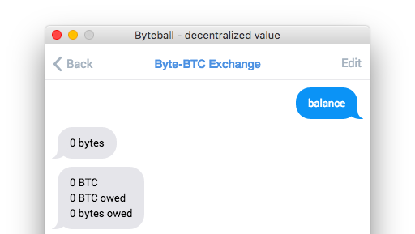

# BTC exchange

The exchange allows your customers to exchange bitcoins to bytes and bytes to bitcoins.  No registration required, the customer just chats with a chatbot in his [Byteball wallet](../../../byteball).

## Install

Install [bitcore](https://bitcore.io/guides/full-node/) and create new bitcore node:
```
bitcore create -d ~/.bitcore/data byteball-btc-exchange
```
(add `--testnet` to work on testnet).  Here `~/.bitcore/data` is the location of your data directory where full Bitcoin bockchain will be stored, `byteball-btc-exchange` is the name of your node.  `cd` to your node folder:
```
cd byteball-btc-exchange
```
Install `btc-exchange` service:
```
npm install btc-exchange
```
Edit your `bitcore-node.json` to add `btc-exchange` service and remove `web` service.  The file should look like this:
```
{
  "network": "livenet",
  "port": 3001,
  "services": [
    "bitcoind",
    "btc-exchange"
  ],
  "servicesConfig": {
    "bitcoind": {
      "spawn": {
        "datadir": "/home/YourUserName/.bitcore/data",
        "exec": "/usr/lib/node_modules/bitcore/node_modules/bitcore-node/bin/bitcoind"
      }
    }
  }
}
```
Start your node (which automatically starts the `btc-exchange` service):
```
bitcored
```
After you start it for the first time, it will exit immediately complaining about missing SQLite tables.  Open your sqlite database:
```
sqlite3 ~/.config/bitcore/byteball.sqlite
```
and execute all SQL from [btc-exchange.sql](btc-exchange.sql), then start the node again.  It will ask you about the name of the exchange (it will be displayed in chat windows of your clients) and your passphrase.  Choose a good passphrase as it will protect your and your customers' bytes that will be stored online.  The second time, your node will also exit complaining about missing admin_email conf setting.  This is the email where you will receive important notifications from your node.  Edit your `~/.config/bitcore/conf.json`, it should look like this:
```
{
	"deviceName": "Byte-BTC Exchange",
	"admin_email": "admin@yourdomain.com",
	"from_email": "btc-exchange-alerts@yourdomain.com",
	"hub": "byteball.org/bb",
	"bWantNewPeers": false,
	"socksHost": "127.0.0.1",
	"socksPort": 9050,
	"socksLocalDNS": false,
	"control_addresses": ["DEVICE ADDRESS OF YOUR GUI WALLET"],
	"payout_address": "YOUR BYTEBALL ADDRESS WHERE IT IS ALLOWED TO WITHDRAW PROFITS TO",
	"permanent_paring_secret": "0000"
}
```
The socks* settings are recommended to run your node through TOR.  Since you have to store large amounts of customers' bytes and bitcoins online, you don't want potential attackers to know your IP address, and TOR is a good way to hide it (see below).  See the documentation of [headless wallet](../../../headless-byteball) and [core library](../../../byteballcore) to learn about other settings in `conf.json`.

After editing your `conf.json`, start the node again.  It will take some time to sync with both Byteball and Bitcoin networks.

Every time your node starts, it prints its pairing code:
```
====== my device pubkey: A9bg4s0ZI36PcTp4p8sNywZ+DGeFm9dP75TcACI22Byz
my pairing code: A9bg4s0ZI36PcTp4p8sNywZ+DGeFm9dP75TcACI22Byz@byteball.org/bb#0000
```
Put this code on your site so that your customers are able to start an exchange by clicking a link:
```
<a href="byteball:A9bg4s0ZI36PcTp4p8sNywZ+DGeFm9dP75TcACI22Byz@byteball.org/bb#0000">start a chat with the exchange chatbot</a>
```
If you open this link in your control device (specified in `control_addresses`), you have access to admin functions, see the documentation for [headless wallet](../../../headless-byteball).  Type `balance` to see the current balances of the exchange:



## Security
Since you are keeping large amounts of customers' funds online, your exchange is a lucrative target for attackers.  But unlike web-based exchanges, your exchange is running in chat interface, which makes it unnecessary to accept incoming connections and have publicly known IP addresses.  This means that in addition to standard security measures, you can also completely hide the IP address of your server from potential attackers so that it won't be easy for them to learn what server to attack in the first place.

Although your node doesn't have to accept incoming connections, it still has to establish outgoing connections, at least with the hub, which can leak your IP address.  To avoid that, run your node through TOR by setting `socksHost`, `socksPort`, and `socksLocalDNS` in your `conf.json`.  Also, configure your bitcoin node to run through TOR by adding
```
proxy=127.0.0.1:9050
```
in your `bitcoin.conf`.
